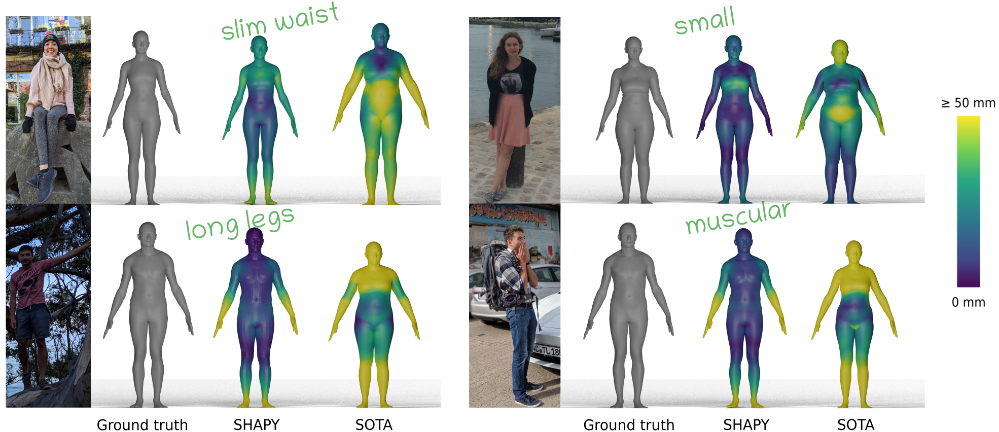
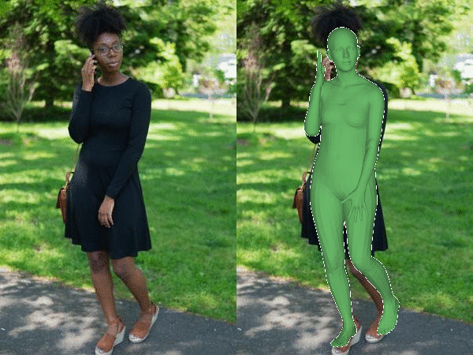
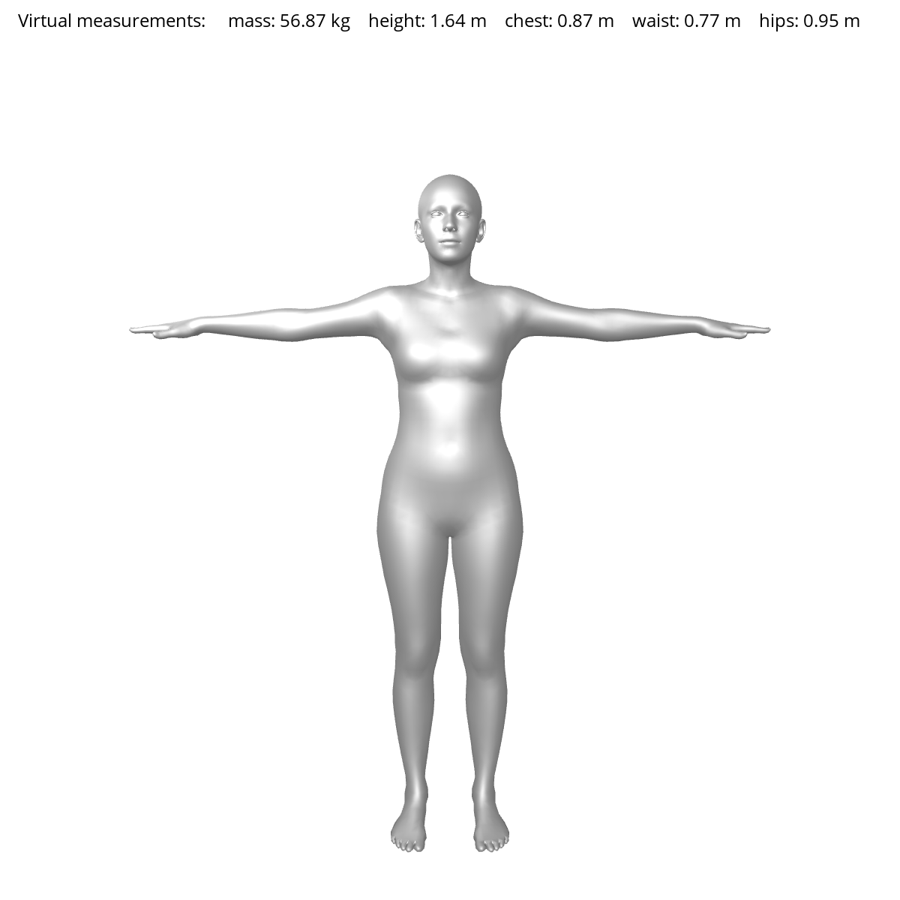
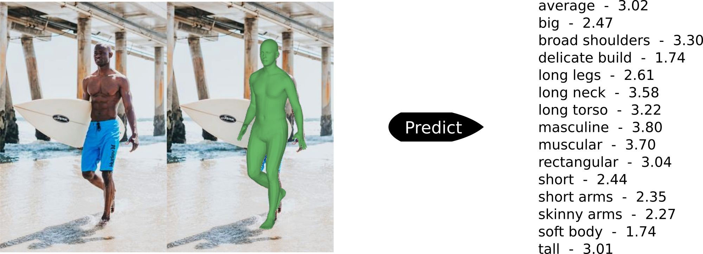

# SHAPY
<b> Accurate 3D Body Shape Regression using Metric and Semantic Attributes. </b>\
[[Project Page](https://shapy.is.tue.mpg.de)] [[Paper](https://ps.is.mpg.de/uploads_file/attachment/attachment/691/00928.pdf)] [[MPI Project Page](https://ps.is.mpg.de/publications/shapy-2022)]




## In this repo you will find ...
... [SHAPY](#regressor), a state-of-the-art network that predicts the body shape of a person from a single image. The body shape is represented as [SMPL-X](https://smpl-x.is.tue.mpg.de) parameters or metric measurements, i.e. height, weight and chest/waist/hip circumference.

... [Virtual Measurements](#virtual-measurements), a method to compute body measurements from a 3D human mesh.

... [Shape to Attributes](#shape-to-attributes-s2a), a model to obtain ratings how much a word that describes body shape applies to a SMPL-X body.

... [Attribute to Shape](#attributes-to-shape-a2s), a model to obtain the body shape of a person from linguistic attribute ratings and body measurements. 


##  News
- [2023/05/22] Since some people have trouble installing SHAPY. Here's a [Google Colab](https://colab.research.google.com/drive/16b5bgRrkdMkI7VILa8GS3m6yQeLH2xGI?usp=sharing).
- [2022/08/11] The HBW Test split evluation protocol is available. See [HBW Test](regressor/hbw_evaluation/README_HBW_EVAL.md).
- [2022/08/11] Supporting SHAPY evaluation on the HBW validation set. See [Evaluation](#evaluation).


## License

Software Copyright License for **non-commercial scientific research purposes**. Please read carefully the following [terms and conditions](https://github.com/muelea/shapy/blob/master/LICENSE) and
any accompanying documentation before you download and/or use the SHAPY data and software, (the "Data & Software"), including 3D meshes, alignments, measurements, images, videos, textures, software,
scripts, and animations. By downloading and/or using the Data & Software (including downloading, cloning, installing, and any other use of the corresponding github repository), you acknowledge that
you have read these terms and conditions, understand them, and agree to be bound by them. If you do not agree with these terms and conditions, you must not download and/or use the Data & Software.
Any infringement of the terms of this agreement will automatically terminate your rights under this [License](./LICENSE).


## Installation
Please see [Installation](./documentation/INSTALL.md) for details.


## Datasets

We publish two new datasets. Please see [Dataset](./documentation/DATA.md) for details. We also provide information how to evaluate your own method on our dataset Human Bodies in The Wild (HBW).

## SHAPY Demo
#### Regressor

<p align="center">
    
</p>

```
cd regressor

# run SHAPY regressor to estimate body shape for images in the wild
python demo.py --save-vis true --save-params true --save-mesh true --split test --datasets openpose --output-folder ../samples/shapy_fit/ --exp-cfg configs/b2a_expose_hrnet_demo.yaml --exp-opts output_folder=../data/trained_models/shapy/SHAPY_A part_key=pose datasets.pose.openpose.data_folder=../samples datasets.pose.openpose.img_folder=images  datasets.pose.openpose.keyp_folder=openpose datasets.batch_size=1 datasets.pose_shape_ratio=1.0
```


#### Virtual Measurements

<p align="center">
    
</p>
We compute virtual measurements from a 3D mesh in SMPL topology.

```
cd measurements

# given SMPL betas compute anthropometric measurements
python virtual_measurements.py --input-folder ../samples/shapy_fit_for_virtual_measurements/ --output-folder=../samples/virtual_measurements/
```

#### Shape to Attributes (S2A)



We use SMPL-X body shape parameters, predicted by our SHAPY regressor, as input to our S2A model. The estimated ratings are not scaled. The S2A training data, however, ranges from 1.0 to 5.0. Consequently, a predicted rating of 1.0 relates to "strongly disagree" (that the attribute applies to the body shape) whereas a rating value of 5.0 relates to "strongly agree" (that the attribute applies to the body shape).

```
cd attributes

# given neutral betas estimate female attribute ratings
python demo.py --exp-cfg configs/s2a.yaml --exp-opts output_dir=../data/trained_models/b2a/polynomial/caesar-female_smplx-neutral-10betas ds_gender=female model_gender=neutral num_shape_comps=10

# given neutral betas estimate male attribute ratings
python demo.py --exp-cfg configs/s2a.yaml --exp-opts output_dir=../data/trained_models/b2a/polynomial/caesar-male_smplx-neutral-10betas ds_gender=male model_gender=neutral num_shape_comps=10
```

#### Attributes to Shape (A2S)


Our demo data contains collected attribute ratings and body measurements (height, chest/waist/hip circumference) of two female models, [Ali Tate](https://www.modelwerk.de/page/model-5709/Ali_Tate.html) and [Judy Kinuthia](https://www.modelwerk.de/page/model-6672/Judy_Kinuthia.html), and two male models, [Joep](https://www.ullamodels.com/joep) and [AJ](https://www.curve-models.com/men/main/244-aj-buitendijk/). The demo code
predicts SMPL-X shape parameters from attributes (a), attributes + height (b), and attributes + height + chest + waist + hips for females (c, d) and males (e, f).

```
cd attributes

# a) female attributes to gender-specific betas
python demo.py --demo_output_folder ../samples/a2s_fit/00_a2s_ff --exp-cfg configs/a2s_variations_polynomial/00_a2s.yaml --exp-opts output_dir=../data/trained_models/a2b/caesar-female_smplx-female-10betas/poynomial/00_a2s.yaml/ ds_gender=female model_gender=female num_shape_comps=10

# b) female attributes + height to gender-specific betas
python demo.py --demo_output_folder ../samples/a2s_fit/01b_ah2s_ff --exp-cfg configs/a2s_variations_polynomial/01b_ah2s.yaml --exp-opts output_dir=../data/trained_models/a2b/caesar-female_smplx-female-10betas/poynomial/01b_ah2s.yaml/ ds_gender=female model_gender=female num_shape_comps=10

# c) female attributes + height + chest + waist + hips to gender-specific betas
python demo.py --demo_output_folder ../samples/a2s_fit/04b_ahcwh2s_ff --exp-cfg configs/a2s_variations_polynomial/04b_ahcwh2s.yaml --exp-opts output_dir=../data/trained_models/a2b/caesar-female_smplx-female-10betas/poynomial/04b_ahcwh2s.yaml/ ds_gender=female model_gender=female num_shape_comps=10

# d) female attributes + height + chest + waist + hips to gender-neutral betas
python demo.py --demo_output_folder ../samples/a2s_fit/04b_ahcwh2s_fn --exp-cfg configs/a2s_variations_polynomial/04b_ahcwh2s.yaml --exp-opts output_dir=../data/trained_models/a2b/caesar-female_smplx-neutral-10betas/poynomial/04b_ahcwh2s.yaml/ ds_gender=female model_gender=neutral num_shape_comps=10

# e) male attributes + height + chest + waist + hips to gender-neutral betas
python demo.py --demo_output_folder ../samples/a2s_fit/04b_ahcwh2s_mn --exp-cfg configs/a2s_variations_polynomial/04b_ahcwh2s.yaml --exp-opts output_dir=../data/trained_models/a2b/caesar-male_smplx-neutral-10betas/poynomial/04b_ahcwh2s.yaml/ ds_gender=male model_gender=neutral num_shape_comps=10

# f) male attributes + height + chest + waistß + hips to gender-specific betas
python demo.py --demo_output_folder ../samples/a2s_fit/04b_ahcwh2s_mm --exp-cfg configs/a2s_variations_polynomial/04b_ahcwh2s.yaml --exp-opts output_dir=../data/trained_models/a2b/caesar-male_smplx-male-10betas/poynomial/04b_ahcwh2s.yaml/ ds_gender=male model_gender=male num_shape_comps=10

```


## Evaluation
You can evaluate SHAPY on the HBW valiation set. To evaluate your own model on the HBW test set, please follow the instructions [here](regressor/hbw_evaluation/README_HBW_EVAL.md).

First, create a symlink in $SHAPY_REPO/datasets to your original HBW folder:
`ln -s $HBW_FOLDER $SHAPY_REPO/datasets/HBW`. Alternatively, you can change the 
HBW data_folder (l.46) in `regressor/configs/b2a_expose_hrnet_eval_shape.yaml`.

```
cd regressor

python evaluate.py --exp-cfg configs/b2a_expose_hrnet_eval_shape.yaml --exp-opts output_folder=../data/trained_models/shapy/SHAPY_A datasets.batch_size=1 datasets.pose_shape_ratio=0.0 is_training=False run_final_evaluation_on_validation_set=True
```


## Citation
```
@inproceedings{Shapy:CVPR:2022,
  title = {Accurate 3D Body Shape Regression using Metric and Semantic Attribute},
  author = {Choutas, Vasileios and M{\”u}ller, Lea and Huang, Chun-Hao P. and Tang, Siyu and Tzionas, Dimitris and Black, Michael J.},
  booktitle = {Proceedings IEEE/CVF Conf.~on Computer Vision and Pattern Recognition (CVPR)},
  month = jun,
  year = {2022},
  month_numeric = {6}
}
```

## Acknowledgments

This work was supported by the Max Planck ETH Center for Learning Systems and the International Max Planck Research School for Intelligent Systems. We thank Tsvetelina Alexiadis, Galina Henz, Claudia Gallatz, and Taylor McConnell for the data collection, and Markus Höschle for the camera setup. We thank
Muhammed Kocabas, Nikos Athanasiou and Maria Alejandra Quiros-Ramirez for the insightful discussions.


## Disclosure

Conflict of interest disclosure for Michael J. Black March 11, 2022 MJB has received research gift funds from Adobe, Intel, Nvidia, Meta/Facebook, and Amazon. MJB has financial interests in Amazon, Datagen Technologies, and Meshcapade GmbH. While MJB was a part-time employee of Amazon during this project, his research was performed solely at, and funded solely by, the Max Planck Society.


## Contact

For questions, please contact shapy@tue.mpg.de

For commercial licensing (and all related questions for business applications), please contact ps-licensing@tue.mpg.de.
